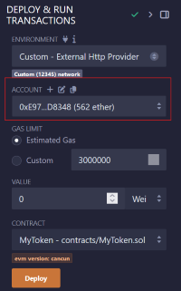
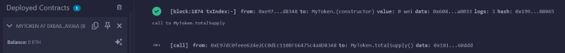
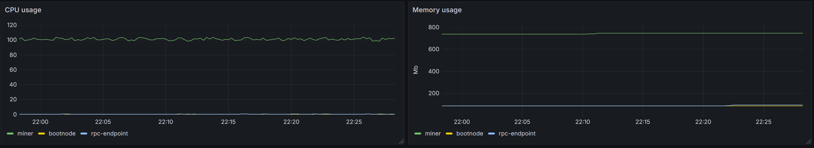

# ata-devops

## Prerequisites

- Docker v20+
- Helm v3.16+
- Terraform v1.10+
- Minikube v1.34+
- Geth v1.14.2+

## Mission 1: Terraform

1. Services required for the task below are deployed via Terraform, refer to [main.tf](./infrastructure/main.tf).
2. Configured to store the terraform state in [S3 bucket](./infrastructure/backend.tf), refer to [backend.tf](./infrastructure/terraform.tf).
3. Deploy the services.
   ```bash
   cd infrastructure
   terraform apply --auto-approve
   ```

## Mission 2: Blockscout

1. Replace the `envFromSecret.DATABASE_URL` in [values.yml](./blockscout-stack/values.yaml) with the Postgres DB created from Terraform.
2. Start minikube cluster with addons ingress and metrics-server.
   ```bash
   minikube start
   minikube addons enable ingress
   minikube addons enable metrics-server
   ```
3. (Optional) If Prometheus Community Helm repository is not in your Helm configuration, add and update the repo.
   ```bash
   helm repo add prometheus-community https://prometheus-community.github.io/helm-charts
   helm repo update
   ```
4. Deploy the Helm chart.
   ```bash
   # helm install <RELEASE_NAME> <CHART>
   helm install prometheus-operator prometheus-community/prometheus-operator-crds
   helm install blockscout blockscout-stack/
   ```
5. Export frontend service to access the Blockscout UI.
   ```bash
   # minikube service <RELEASE_NAME>-frontend-svc
   minikube service blockscout-frontend-svc
   ```
6. HorizontalPodAutoscaler is enabled for Blockscout deployment, refer to [blockscout-hpa.yaml](./blockscout-stack/templates/blockscout-hpa.yaml)
7. Charts release is packaged via Github [actions](./.github/workflows/release.yaml) and published on https://jackht7.github.io/ata-devops/index.yaml

## Mission 3: Contract Indexer

1. Setup a Prometheus instance in Grafana Cloud.
2. Replace the Prometheus `QUERY_ENDPOINT`, `INSTANCE_ID` and `API_TOKEN` in [prometheus.yml](./contract-indexer/prometheus/prometheus.yml).
3. Replace the `INFURA_PROJECT_ID` in [docker-compose.yml](./contract-indexer/docker-compose.yml)
4. Run the indexer and Prometheus server.
   ```bash
   cd contract-indexer
   docker compose up
   ```
5. Setup the Grafana dashboard to show the metrics (`usdt_tx_count_total`, `usdt_tokens_transferred_total`) collected from [indexer](./contract-indexer/indexer.js). In the dashboard, choose the Prometheus instance as data source and set the following queries.
   ```
   rate(usdt_tx_count_total{status="success"}[$__rate_interval])
   rate(usdt_tokens_transferred_total{status="success"}[$__rate_interval])
   ```
   Example dashboard:
   
6. Create an alert rule that check if the metric,`usdt_tokens_transferred_total_in_one_transaction`, the total USDT tokens transferred in one transaction greater than 1 million.
   ```
   sum(usdt_tokens_transferred_total_in_one_transaction) by (transactionHash) > 1000000
   ```

## Mission 4: Stress Testing

1. Generate the nodekey and the enode value of the bootnode.
   ```bash
   cd node-and-stress-testing
   bootnode -genkey bootnode.key
   bootnode -nodekeyhex <NODEKEYHEX_FROM_FILE> -writeaddress
   ```
   The enode URL can be constructed from the value using the pattern below.
   ```
   enode://<ENODE_VALUE>@<IP_ADDRESS>:<PORT>
   ```
2. Replace the `NODEKEYHEX` and `ENODE_VALUE` with the values generated above in [docker-compose.yml](./node-and-stress-testing/docker-compose.yml)
3. Docker build and Run the private geth network.
   ```bash
   docker compose build
   docker compose up
   ```
4. To ensure the private blockchain is running, check if the latest block number can be retrived via RPC node. The number returned should be greater than 0x0.
   ```bash
   curl --location --request POST 'localhost:8545' \
   --header 'Content-Type: application/json' \
   --data-raw '{
    "jsonrpc": "2.0",
    "id": 1,
    "method": "eth_blockNumber",
    "params": []
   }'
   ```
5. Copy the keystore generated from geth-client container to local.
   ```bash
   docker ps
   docker cp miner:/root/.ethereum/keystore ./data/keystore
   ```
6. Import the account to Metamask using the file and password.
7. Deploy an ERC20 smart contract [MyToken.sol](./node-and-stress-testing//contract/MyToken.sol) to the private blockchain via [Remix](https://remix.ethereum.org/) with env `Injected Provider - Metamask` or `External Http Provider - http://localhost:8545`.

   Environment and account setup

   

   Smart contract deployed

   

8. Log in to [Grafana](http://localhost:3000) UI and setup Prometheus data source `http://prometheus:9090`.
9. Add Grafana panel with the queries to check the CPU and Memory usage for container `miner`, `bootnode`, and `rpc-endpoint`.

   ```bash
   # sum(rate(container_cpu_usage_seconds_total{name="<container_name>"}[$__rate_interval])) by (name) *100
   sum(rate(container_cpu_usage_seconds_total{name="miner"}[$__rate_interval])) by (name) *100

   # sum(container_memory_rss{name="<container_name>"}) by (name) /1024/1024
   sum(container_memory_rss{name="miner"}) by (name) /1024/1024
   ```

   Example dashboard:  
   

10. Replace the `PRIVATE_KEY` (the account imported to Metamask), `CONTRACT_ADDRESS` (the contract deloyed above) and `RECIPIENT_ADDRESS` in [.env](./node-and-stress-testing/.env)
11. Run the [load-test](./node-and-stress-testing/load-test.js) script.
    ```bash
    npm install
    npm run prepare
    npm run start
    ```
